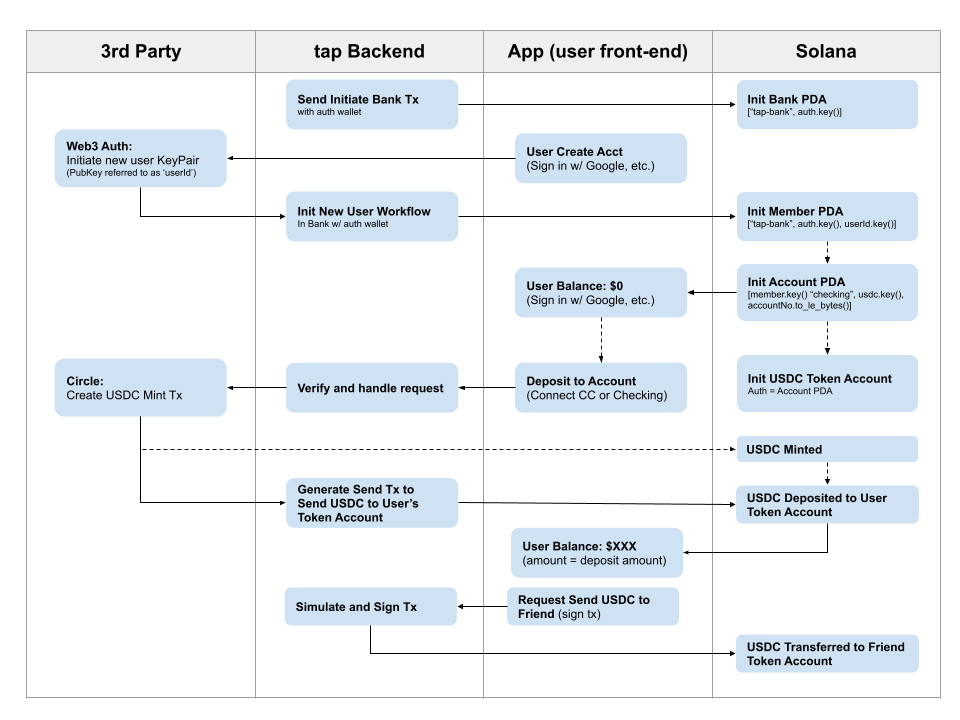

# tap
*digital cash, for everyone*. **tap** is a user-first mobile cash app designed for mainstream adoption.

Submission to 2023 Solana Grizzlython Submission by: 
- Aaron Milano (amilz) ([GitHub](https://github.com/amilz), [LinkedIn](https://www.linkedin.com/in/aaronmilano/))  
- Austin Milt ([GitHub](https://github.com/austinmilt), [LinkedIn](https://www.linkedin.com/in/austinmilt/)) 
- Special Thanks to [Matcha Design Labs](https://www.matchadesignlabs.com/) for 🔥 UI/UX design work 

#### Resources
- [Pitch Deck](https://docs.google.com/presentation/d/1_u_i_yqSlY2ZjhBJsdlTOUyJ7z1OH891Pro1LJQSPpA/edit#slide=id.g2196631c208_1_103) 
- [Android APK Download](https://todo)
- [tap app Local Development](#tap-app-local-development)
- [tap HomePage](https://tapcash.app)
- [tap Twitter](https://twitter.com/tapcashapp)

#### Summary of Submission Features
- SSO with Gmail
- Multi-sig custodial “checking” account
- Credit Card onramp
- Feeless peer-to-peer transfers
- Parsed Solana Transactions Activity Feed
- Live on Solana Devnet
- Live on Android

#### Tech Stack
- Anchor: [Bank program](./program/tap_cash/) that manages user accounts and multi-sign USDC wallets
    - TypeScript: [Program SDK](./backend/src/program/sdk.ts)
- Web3 Auth SDK: Single sign-in with Google and non-custodial signing wallet
- React-Native: [mobile UI/UX](./src/)
- Circle SDK: [Credit Card on-ramp](./backend/src/circle/)
- Google Firestore: [Database](./backend/src/db/) for storing user public info
- Google Cloud Functions: [Serverless API backend](./backend/src/index.ts) 
- NextJs: [Landing Page](https://tapcash.app)

#### Detailed User Flow
**New Users** 

Users create an account by logging in with gmail account. 
- Users are authenticated and receive a non-custodial Solana wallet via [Web3 Auth](https://web3auth.io/). 
- On account initiation, the tap program ([Devnet](https://explorer.solana.com/address/TAPAPp2YoguQQDkicGyzTzkA3t4AgECvR1eL1hbx9qz?cluster=devnet): `TAPAPp2YoguQQDkicGyzTzkA3t4AgECvR1eL1hbx9qz`) initiates a new Member PDA for the [Tap "Bank"](https://explorer.solana.com/address/AU88yciXy2Rz2DJkUUFu2gpYqaPRLngd3sevSfAH8KyS/anchor-account?cluster=devnet). 
- A user "Checking" account is created (seeded on the member PDA), and a USDC ATA owned by the member account is initiated. 
- All initiation fees and rent are paid by the Tap Bank. 

**Deposits**

- Users deposit funds to their account a credit card using the Circle payments API
- Currently, devnet assigns a random credit card to the user (manual credit card entry is disabled)
- On confirmation of payment, funds are transferred from tap account to users USDC token account
- Balance is updated on users homepage and the transaction on recent activity (custom parsed Solana transaction history)

**Transfers**

- Users can initiate a peer to peer transfer via the "Send" button on the home page. 
- Users query other tap members via a search that looks up other members by email via our Google Backend.
- Users select a user and amount and send the transaction to our backend.
- The program transfer function requires 3 signatures: the Program, the tap Bank authority, and the user.
- Once the transaction is confirmed on chain, balance and transfer are updated on the user homepage.

#### Present Limitations/Known Issues
- Some features currently disabled on devnet: 
    - Cash withdrawals
    - Add/remove payment methods (we use random dummy credit cards for devnet)
- Currently in-app transfers limited to other users on the platform. This is intentional for early release, but not a limitation of our future capabilities. In an effort to simplify the UX, we are activity avoiding introducing any reference to crypto, blockchain, public/secret keys, gas, Solana, etc.
- Similarly, because tap is targetted to a non-crypto native user, we did not build in the seed vault or incorporate exporting secret keys (though these are features that can easily be added at a later date when customer's are ready for such features)
- Current demo is limited to Android, however since we built with React Native, we should be able to add iOS in the near future
- The user must sign in through web3auth on every launch of the app. In the future we may encrypt the user's credentials on their device to reduce start times. Because USDC transfers are gated through our backend, users that lose their device would be able to disable their account. And because we use an OAuth provider for their wallet, they can use the same Google account across devices.

***

# tap app Local Development

To deploy tap locally, you will need to set up the following:
- tap Solana Program (detailed setup and delpoyment instructions [here](./backend/README.md)))
- Backend (detailed setup and delpoyment instructions [here](./backend/README.md))
- Frontend (detailed setup and delpoyment instructions below 

## Front End Set Up

### Install Dependencies
Follow these directions https://reactnative.dev/docs/environment-setup but skip Creating a new application.

In a terminal in the project directory run `npm install`

### Set up Environment
- Set your environment `JAVA_HOME` to the location of the JRE, e.g. `"C:\Program Files\Android\Android Studio\jre"`
- Rename `.env.example` to `.env.local`
- Set environment variables, `WEB3_AUTH_CLIENT_ID` and 
- Set `USDC_MINT_ADDRESS` to the address of the same USDC token mint as `FAKE_USDC_ADDRESS` and `USDC_MINT_ADDRESS` in the [./backend/.env.example.yaml](./backend/.env.example.yaml).

### Starting the App
You must have run the setup steps already.

1. [Start the backend and local validator](./backend/README.md) ([./backend](./backend)).
2. In one terminal, run `emulator -avd Pixel_6_Pro_API_33`. Replace `Pixel_6_Pro_API_33` with whatever AVD you are testing with. Alternatively, you can: 
    - Run a device emulator from Android Studio or
    - If you're testing on a physical device, get your physical device connected to `adb`.
3. In a second terminal, start Metro: `npm start-windows` or `npm start`. Choose one of the options that pop up (probably pressing `a` to run on Android).

The app will start on your emulator or device, and you should see the blue `tap` splash screen.